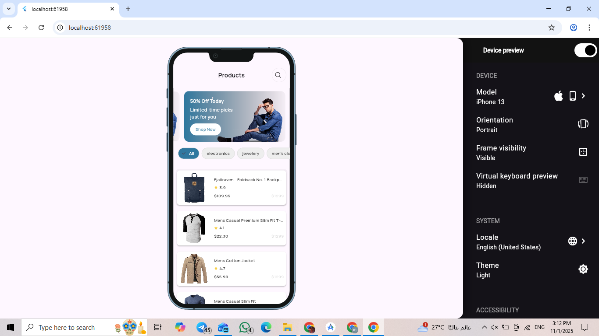
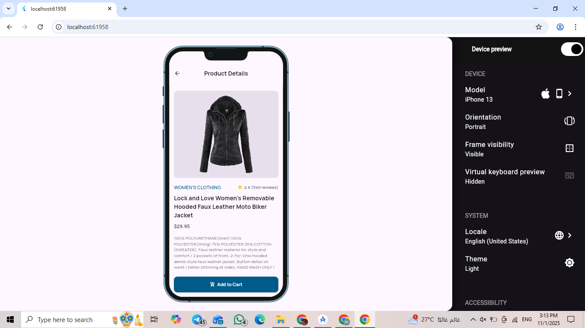
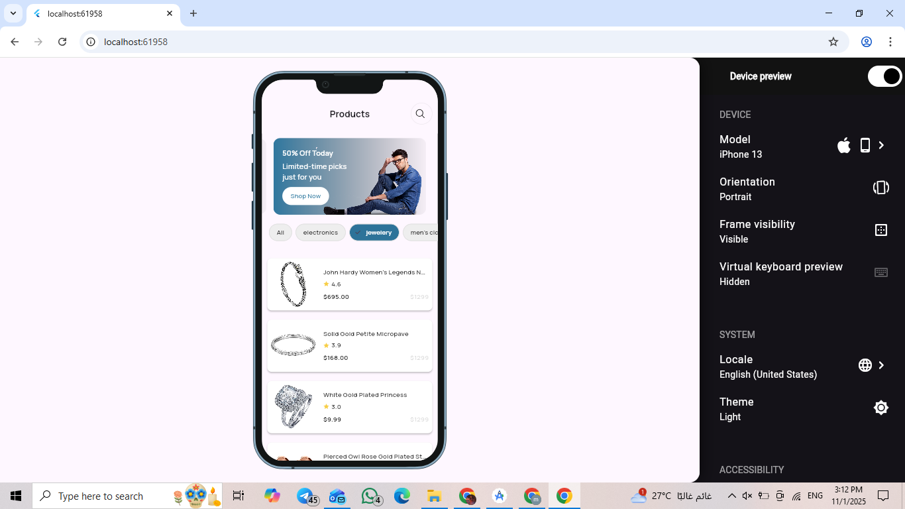
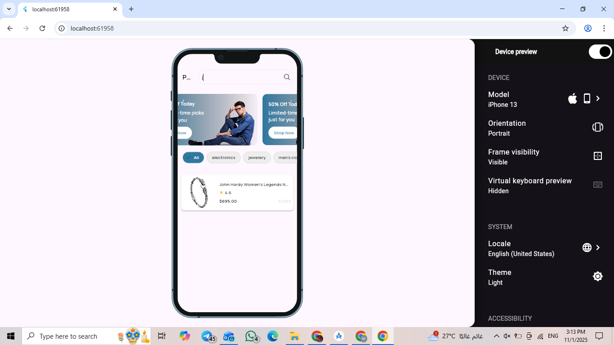

# 🛒 Flutter Task (Fake Store API)

A simple and clean Flutter e-commerce application built using **BLoC architecture**, **Dio**, and **Retrofit** for API integration.  
The app displays a list of products, categories, and detailed product information fetched from [FakeStoreAPI](https://fakestoreapi.com/).

---

## 🚀 Features
- Fetch and display product list with images, prices, and ratings.
- Browse by category.
- Search for products.
- View detailed product information.
- Responsive and modern UI.

---

## 🧩 Architecture
This project follows **Clean Architecture** principles:
lib/
┣ core/
┣ data/
┣ logic/
┣ presentation/
┣ main.dart
test/
┣ unit/
┃ ┗ product_repository_test.dart
┣ widget/
┃ ┗ widget_test.dart
integration_test/
┣ app_test.dart


## ⚙️ Tech Stack
- **Flutter** 🐦
- **BLoC (flutter_bloc)**
- **Dio** + **Retrofit**
- **Json Serializable**

## 📦 Installation & Run

Clone the repo:
```bash
git clone https://github.com/amira-ezzat/Qodera_Task.git
Install dependencies:
flutter pub get
Run App:
flutter run

```
## 🖼️ Screenshots

### Home Screen


### Product Details


### Categories


### Search



## 🧪 Testing

✅ Unit Tests
Test repositories and helper logic under:
test/unit/unit_test.dart
Run:
flutter test test/unit/unit_test.dar

✅ Widget Tests
Test UI components (like product cards or search bar) under:
test/widget/widget_test.dart
Run:
flutter test test/widget/widget_test.dart

✅ Integration Tests
Test the full app flow (API data load → UI display) under:
integration_test/app_test.dart
Run:
flutter devices
flutter test integration_test/app_test.dart -d device ID


Run all tests:
flutter test


‍💻 Author
Amira Ezzat
📧 [amiraezzat.fci@gmail.com]
💼 Flutter Developer